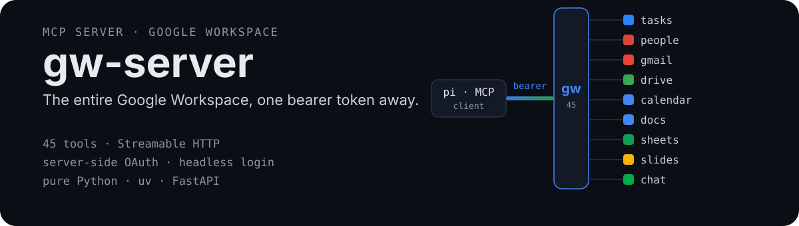
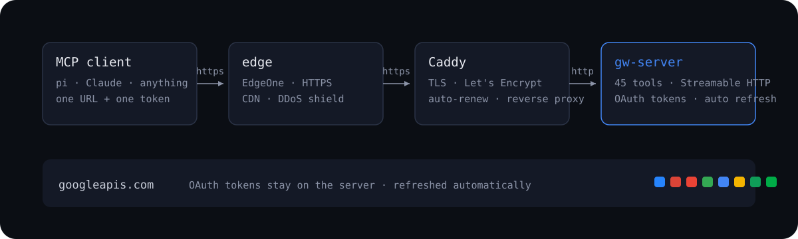

<p align="center">
  
</p>

```bash
$ curl -s https://your-domain/mcp \
    -H "Authorization: Bearer $GW_TOKEN" \
    -H 'Content-Type: application/json' \
    -H 'Accept: application/json, text/event-stream' \
    -d '{"jsonrpc":"2.0","id":1,"method":"tools/list"}' | jq '.result.tools | length'

45
```

**Forty-five tools.** Gmail, Drive, Calendar, Docs, Sheets, Slides, Chat, Tasks
and Contacts — discovered and called directly by your AI client. No SDK, no
googleapis, no browser on the server.

## What is this

`gw-server` turns Google Workspace into [MCP](https://modelcontextprotocol.io)
tools. It holds the OAuth tokens server-side, refreshes them automatically,
and speaks Streamable HTTP — so any MCP client wires up with one URL and one
bearer token, and immediately gets 45 named tools plus a generic escape hatch
for any Google REST endpoint.

<p align="center">
  
</p>

## Why gw-server

- **Headless OAuth.** Start a login from the server, open the link on your
  phone, consent — tokens land on the server. The host never needs a browser.
- **Everything is a tool.** 45 named tools across nine Google services, plus
  `gapi`, a generic escape hatch for any Google REST endpoint.
- **One secret for clients.** Clients store a URL and a bearer token — Google
  credentials never leave the server.
- **Boring to run.** Pure Python (FastAPI + the official MCP SDK), one `uv`
  project, one systemd unit, Caddy for TLS.

## The tools

| Group | Tools |
| --- | --- |
| core (3) | `accounts_list` · `whoami` · `gapi` — call any Google REST endpoint |
| gmail (10) | `search` · `read` · `send` · `reply` · `draft_create` · `draft_list` · `draft_send` · `modify_labels` · `labels_list` · `attachment_get` |
| drive (10) | `search` · `list` · `read` (Docs auto-export) · `download` · `upload` · `update` · `create_folder` · `move` · `trash` · `share` |
| calendar (6) | `events` · `create` · `update` · `delete` · `calendars_list` · `freebusy` |
| docs (3) | `read` · `create` · `append` |
| sheets (4) | `read` · `list` · `write` · `append` |
| slides (1) | `read` |
| chat (3) | `spaces_list` · `messages_list` · `send` |
| tasks (4) | `lists` · `list` · `add` · `complete` |
| people (1) | `search` |

Multi-account built in: pass `email` to pick an account, omit it when only one
is signed in.

## Quick start

```bash
git clone https://github.com/trtyr/gw-server && cd gw-server
uv sync

export GW_TOKEN=$(openssl rand -hex 32)   # client bearer, required
uv run gw-server                          # listens on 127.0.0.1:8787
```

Wire up any MCP client:

```json
{
  "mcpServers": {
    "gw": {
      "url": "http://127.0.0.1:8787/mcp",
      "auth": "bearer",
      "bearerToken": "<GW_TOKEN>"
    }
  }
}
```

## Login, from anywhere

```bash
curl -H "Authorization: Bearer $GW_TOKEN" \
  "http://127.0.0.1:8787/oauth/login?email=you@gmail.com"
```

The response contains a Google consent URL. Open it **on any device**, approve,
and the token lands on the server via the OAuth callback — no browser needed
on the host, tokens never pass through your client. Refreshes are automatic.

## Production

A hardened deployment is ~30 minutes: Caddy in front for TLS, the server as a
systemd unit behind it, `GW_PUBLIC_URL` set to your domain, and your MCP
client pointed at `https://<your-domain>/mcp`.

The full walkthrough — systemd unit, Caddyfile, firewall rules, a 中文版 — is
in [docs/deployment.zh.md](docs/deployment.zh.md).

## License

[MIT](LICENSE)
